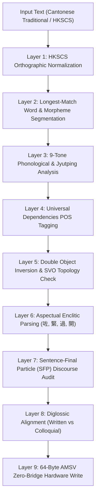

# Cantonese Cognitive Pipeline & 64-Byte AMSV Memory Architecture (Algorithms Layer)

## 1. 9-Layer Cognitive Processing Pipeline



## 2. 64-Byte Atomic Memory State Vector (AMSV) Hardware Layout

Under **The Zero-Bridge Synchronous Memory Rule**, the Cantonese Engine communicates with the hardware runtime via a 64-byte shared physical memory structure (`0x59554554` - "YUET" - 粵):

```
Offset  Bytes  Type       Field Description
--------------------------------------------------------------------------------
0x00    4      char[4]    Magic Bytes: 0x59554554 ("YUET")
0x04    1      uint8_t    Engine Major Version (0x01)
0x05    1      uint8_t    Engine Minor Version (0x00)
0x06    1      uint8_t    Engine Mode (0=Init, 1=Inference, 2=RealTime, 3=Batch)
0x07    1      uint8_t    Register Mode (1=Colloquial/Hau2 Jyu5, 2=Written/Syu1 Min6)

0x08    8      uint64_t   Tone & SFP Distribution Bitfield
0x10    2      uint16_t   Syntactic Flags:
                          - Bit 0: SVO Order Confirmed
                          - Bit 1: Double Object Inversion Verified (V + DO + IO)
                          - Bit 2: Classifier Definiteness Present
                          - Bit 3: Aspectual Enclitic Present (咗/緊/過)
                          - Bit 4: Comparative Construction (過)
                          - Bit 5: SFP Cluster Present
0x12    1      uint8_t    Syntax Sub-AI Capability Status / Score
0x13    1      uint8_t    DOC Inversion Accuracy Flag (0x01 if correct V+DO+IO)
0x14    1      uint8_t    Phonological 9-Tone & Jyutping Conformity Flag
0x15    1      uint8_t    Aspectual Marker & Negation Flag
0x16    1      uint8_t    Discourse Register Tier (1=Colloquial, 2=Formal)
0x17    1      uint8_t    SFP Evidentiality Concord Flag
0x18    4      float32    Editorial Quality & Grammatical Confidence Score (0.0 .. 1.0)
0x1C    4      uint32_t   Reserved Hardware Extension Vector

0x20    16     uint8_t[16] Semantic & Classifier Category Vector

0x30    4      uint32_t   Task Flags & Execution Status
0x34    1      uint8_t    Syntax Sub-AI Active Flag (0x01 = Active)
0x35    1      uint8_t    Phonology Sub-AI Active Flag (0x01 = Active)
0x36    1      uint8_t    Pragmatic Sub-AI Active Flag (0x01 = Active)
0x37    1      uint8_t    Editorial Sub-AI Active Flag (0x01 = Active)
0x38    8      uint8_t[8] Global Cognitive Attention & Alignment Vector
--------------------------------------------------------------------------------
Total: Exactly 64 Bytes (0-nanosecond physical memory alignment)
```
