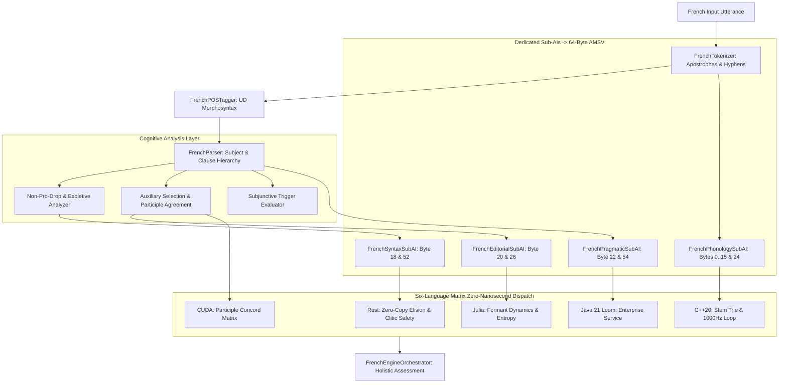

# French Engine Computational Algorithms & Pipeline Architecture

## 1. End-to-End Multi-Pass Cognitive Flow

## 2. Algorithmic Invariants
1. **Zero-Bridge AMSV Synchronization**:
   - Updates directly into the 64-byte `AtomicMemoryStateVector` memory view.
   - Zero serialization overhead, zero bit pollution outside designated offsets.
2. **Elision & Contraction Resolution**:
   - `l'homme` segmented into functional determiner `l'` and noun `homme`.
   - `du` expanded conceptually to `de + le`, `au` to `à + le`, `des` to `de + les`, `aux` to `à + les`.
3. **Compound Tense Parsing**:
   - Two-word verbal predicate detection: Auxiliary (*a*, *est*, *ont*, *sont*) + Participle (*parlé*, *allé*, *fini*).
