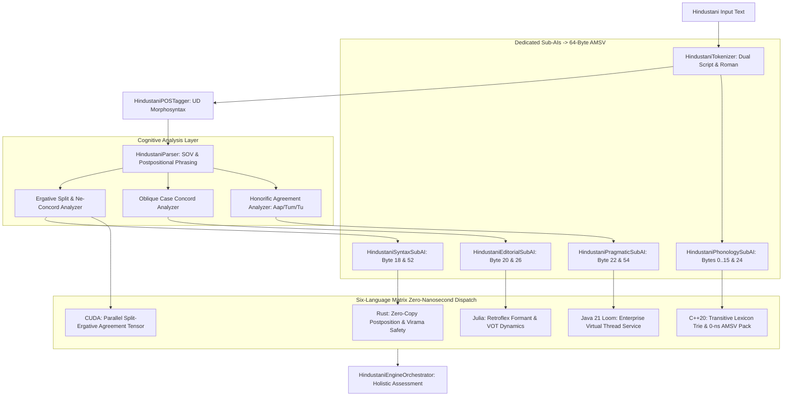

# Hindustani Engine Computational Algorithms & Pipeline Architecture

## 1. Multi-Pass Cognitive & Sub-AI Flow

## 2. Key Algorithmic Invariants
1. **Zero-Bridge Physical Memory Access**:
   - Sub-AIs directly populate the 64-byte `AtomicMemoryStateVector` memoryview with zero bit-bleed outside designated capability slots.
2. **Split-Ergativity Decision Tree**:
   - If tense is perfective/past AND verb lemma is marked transitive:
     - Verify subject possesses the *ne* postposition.
     - If direct object has NO *ko* postposition, enforce verb agreement with direct object gender/number.
     - If direct object has *ko*, enforce neutral default masculine singular (*-a / tha*).
3. **Oblique Nominal Invariant**:
   - Any nominal head preceding an overt postposition (*ne, ko, se, ka, ke, ki, mein, par, tak*) MUST be converted from Direct to Oblique form.
