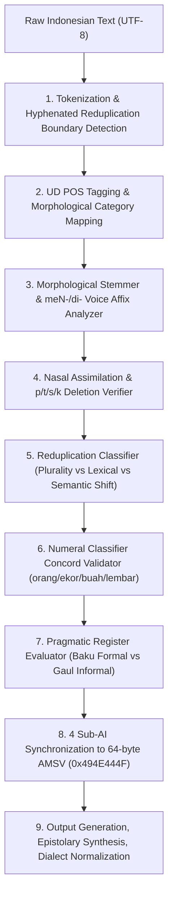

# Layer 7: Algorithms & Pipeline Architecture — Indonesian Language Engine

## 1. 9-Layer Cognitive Processing Pipeline
The Indonesian engine processes natural language through 9 computational stages:

## 2. 64-Byte Atomic Memory State Vector (AMSV) Physical Layout
In strict compliance with **The Zero-Bridge Synchronous Memory Rule**, the Indonesian engine maps directly to a 64-byte physical memory buffer:

| Byte Offset | Field Name | Data Type | Description |
| :--- | :--- | :--- | :--- |
| **0..3** | `magic_header` | `uint32` (LE) | Magic constant `0x494E444F` (ASCII `"INDO"`) |
| **4..7** | `version` | `uint32` (LE) | Engine version `0x00010000` (v1.0.0) |
| **8..11** | `token_count` | `uint32` (LE) | Total number of tokens in active utterance |
| **12..15** | `sentence_count` | `uint32` (LE) | Sentence count |
| **16..17** | `clause_type_mask` | `uint16` (LE) | Bit 0: SVO, Bit 1: Passive (di-), Bit 2: Zero-Passive, Bit 3: Equational |
| **18** | `syntax_flags` | `uint8` | Bit 0: SVO valid, Bit 1: Active meN-, Bit 2: Passive di-, Bit 3: Classifier valid |
| **19** | `morphology_flags` | `uint8` | Bit 0: Affix valid, Bit 1: Circumfix ke-an/pe-an, Bit 2: Reduplication |
| **20** | `phonology_flags` | `uint8` | Bit 0: meN- assimilation valid, Bit 1: ber- r-dropping valid |
| **21** | `aspect_flags` | `uint8` | Bit 0: sudah/telah, Bit 1: belum, Bit 2: sedang, Bit 3: akan |
| **22** | `register_tier` | `uint8` | `0`: Informal (Gaul), `1`: Formal (Baku), `2`: Diplomatic / Surat Resmi |
| **23** | `pragmatic_flags` | `uint8` | Bit 0: Bapak/Ibu honorific, Bit 1: Formal closing, Bit 2: Peribahasa idiom |
| **24..27** | `confidence_score`| `float32` (LE) | Holistic syntactic and grammatical confidence [0.0 .. 1.0] |
| **28..51** | `reserved_payload`| `uint8[24]` | Reserved for matrix neural heads and embeddings |
| **52** | `syntax_sub_ai_id` | `uint8` | `1` when `IndonesianSyntaxSubAI` successfully executed |
| **53** | `phonology_sub_ai_id`| `uint8` | `1` when `IndonesianPhonologySubAI` successfully executed |
| **54** | `pragmatic_sub_ai_id`| `uint8` | `1` when `IndonesianPragmaticSubAI` successfully executed |
| **55** | `editorial_sub_ai_id`| `uint8` | `1` when `IndonesianEditorialSubAI` successfully executed |
| **56..63** | `tail_checksum` | `uint64` (LE) | 64-bit alignment and verification checksum |
