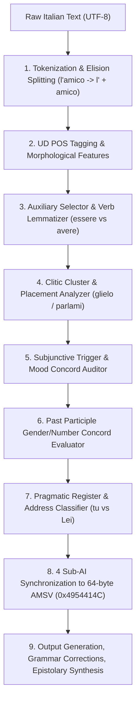

# Layer 7: Algorithms & Pipeline Architecture — Italian Language Engine

## 1. 9-Layer Cognitive Processing Pipeline
The Italian engine processes natural language through 9 computational stages:

## 2. 64-Byte Atomic Memory State Vector (AMSV) Physical Layout
In strict compliance with **The Zero-Bridge Synchronous Memory Rule**, the Italian engine maps directly to a 64-byte physical memory buffer:

| Byte Offset | Field Name | Data Type | Description |
| :--- | :--- | :--- | :--- |
| **0..3** | `magic_header` | `uint32` (LE) | Magic constant `0x4954414C` (ASCII `"ITAL"`) |
| **4..7** | `version` | `uint32` (LE) | Engine version `0x00010000` (v1.0.0) |
| **8..11** | `token_count` | `uint32` (LE) | Total number of tokens in active utterance |
| **12..15** | `sentence_count` | `uint32` (LE) | Sentence count |
| **16..17** | `clause_type_mask` | `uint16` (LE) | Bit 0: Main, Bit 1: Subordinate, Bit 2: Subjunctive, Bit 3: Relative |
| **18** | `syntax_flags` | `uint8` | Bit 0: SVO valid, Bit 1: Pro-drop, Bit 2: Clitic chain, Bit 3: Congiuntivo verified |
| **19** | `auxiliary_flags` | `uint8` | Bit 0: Avere selected, Bit 1: Essere selected, Bit 2: Participle concord error |
| **20** | `phonology_flags` | `uint8` | Bit 0: Elision present, Bit 1: Truncation present, Bit 2: Gemination |
| **21** | `morphology_flags` | `uint8` | Bits 0..2: Conjugation (1..3), Bit 3: Irregular, Bit 4: Inchoative (-isc-) |
| **22** | `register_tier` | `uint8` | `0`: Informal (*tu*), `1`: Formal (*Lei*), `2`: Plural Formal (*Loro/Voi*) |
| **23** | `pragmatic_flags` | `uint8` | Bit 0: Formal salutation, Bit 1: Polite closure, Bit 2: Idiom detected |
| **24..27** | `confidence_score`| `float32` (LE) | Holistic syntactic and grammatical confidence [0.0 .. 1.0] |
| **28..51** | `reserved_payload`| `uint8[24]` | Reserved for matrix neural heads and embeddings |
| **52** | `syntax_sub_ai_id` | `uint8` | `1` when `ItalianSyntaxSubAI` successfully executed |
| **53** | `phonology_sub_ai_id`| `uint8` | `1` when `ItalianPhonologySubAI` successfully executed |
| **54** | `pragmatic_sub_ai_id`| `uint8` | `1` when `ItalianPragmaticSubAI` successfully executed |
| **55** | `editorial_sub_ai_id`| `uint8` | `1` when `ItalianEditorialSubAI` successfully executed |
| **56..63** | `tail_checksum` | `uint64` (LE) | 64-bit alignment and verification checksum |
