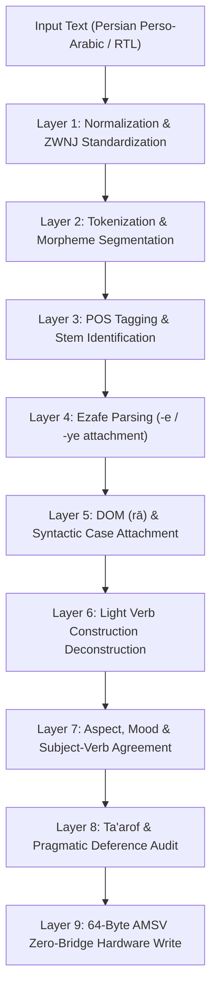

# Persian Cognitive Pipeline & 64-Byte AMSV Memory Architecture (Algorithms Layer)

## 1. 9-Layer Cognitive Processing Pipeline



## 2. 64-Byte Atomic Memory State Vector (AMSV) Hardware Layout

Under **The Zero-Bridge Synchronous Memory Rule**, the Persian Engine communicates with the hardware runtime via a 64-byte shared physical memory structure (`0x46415253` - "FARS"):

```
Offset  Bytes  Type       Field Description
--------------------------------------------------------------------------------
0x00    4      char[4]    Magic Bytes: 0x46415253 ("FARS")
0x04    1      uint8_t    Engine Major Version (0x01)
0x05    1      uint8_t    Engine Minor Version (0x00)
0x06    1      uint8_t    Engine Mode (0=Init, 1=Inference, 2=RealTime, 3=Batch)
0x07    1      uint8_t    Script Mode (1=Perso-Arabic RTL, 2=Tajik Cyrillic, 3=Latin Pinglish)

0x08    8      uint64_t   Phonology & Prosodic Metrical Pattern Bitfield
0x10    2      uint16_t   Syntactic Flags:
                          - Bit 0: SOV Canonical Order Verified
                          - Bit 1: Head-Final Predicate Confirmed
                          - Bit 2: Pro-Drop Ellipsis Active
                          - Bit 3: Ezafe Chain Present
                          - Bit 4: Plural Suffix (-hā / -ān)
                          - Bit 5: Subordinate Clause Present
0x12    1      uint8_t    Syntax Sub-AI Capability Status / Score
0x13    1      uint8_t    DOM (rā) Definiteness Accuracy Flag
0x14    1      uint8_t    ZWNJ & Orthographic Conformity Flag
0x15    1      uint8_t    Light Verb Construction Flag
0x16    1      uint8_t    Ta'arof Register Tier (1=Informal, 2=Formal, 3=High Ta'arof)
0x17    1      uint8_t    Deference & Social Distance Concord Flag
0x18    4      float32    Editorial Quality & Grammatical Confidence Score (0.0 .. 1.0)
0x1C    4      uint32_t   Reserved Hardware Extension Vector

0x20    16     uint8_t[16] Semantic & Idiomatic Feature Representation

0x30    4      uint32_t   Task Flags & Execution Status
0x34    1      uint8_t    Syntax Sub-AI Active Flag (0x01 = Active)
0x35    1      uint8_t    Phonology Sub-AI Active Flag (0x01 = Active)
0x36    1      uint8_t    Pragmatic Sub-AI Active Flag (0x01 = Active)
0x37    1      uint8_t    Editorial Sub-AI Active Flag (0x01 = Active)
0x38    8      uint8_t[8] Global Cognitive Attention & Alignment Vector
--------------------------------------------------------------------------------
Total: Exactly 64 Bytes (0-nanosecond physical memory alignment)
```
