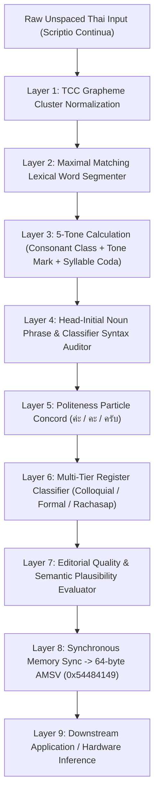

# Pipeline Architecture & Algorithms for Thai (Algorithmic Layer)
## Sovereign Engine: `Thai_engine` | Cognitive Architecture

### 1. 9-Layer Cognitive Flow

---

### 2. Strict 64-Byte AMSV Memory Map (`0x54484149` "THAI")

| Byte Range | Field Name | Width | Type | Sub-AI / Component | Description |
| :--- | :--- | :--- | :--- | :--- | :--- |
| `0x00..0x03` | `magic` | 4 B | `char[4]` | `ThaiMatrixBridge` | ASCII `"THAI"` (`0x54484149`) |
| `0x04` | `version_major` | 1 B | `uint8` | System Header | `0x01` |
| `0x05` | `version_minor` | 1 B | `uint8` | System Header | `0x00` |
| `0x06` | `engine_mode` | 1 B | `uint8` | Orchestrator | `0x01` (Inference) |
| `0x07` | `dialect_mode` | 1 B | `uint8` | Config | `0x01` (Central Standard Thai) |
| `0x08..0x11` | `reserved_head` | 10 B | `uint8[10]`| Reserved | Zero padding |
| `0x12` (18) | `syntax_capability` | 1 B | `uint8` | `ThaiSyntaxSubAI` | Bitfield: S, V, O, Preverbal Aspect |
| `0x13` (19) | `classifier_syntax` | 1 B | `uint8` | `ThaiEditorialSubAI` | `0x01` (Noun + Num + Clf verified) |
| `0x14` (20) | `five_tone_conformity`| 1 B | `uint8` | `ThaiPhonologySubAI` | Bitfield: Valid text, Tone marks, Tones calculated |
| `0x15` (21) | `politeness_concord` | 1 B | `uint8` | `ThaiEditorialSubAI` | `0x01` (Valid ครับ / ค่ะ / คะ concord) |
| `0x16` (22) | `register_tier` | 1 B | `uint8` | `ThaiPragmaticSubAI` | 1=Colloquial, 2=Formal, 3=Monk, 4=Rachasap |
| `0x17` (23) | `segmentation_flag` | 1 B | `uint8` | `ThaiPragmaticSubAI` | `0x01` (Scriptio continua valid) |
| `0x18..0x1B` (24..27)| `editorial_confidence`| 4 B | `float32` | `ThaiEditorialSubAI` | Float32 little-endian (`0.0` .. `1.0`) |
| `0x1C..0x33` | `reserved_payload` | 24 B | `uint8[24]`| Reserved | Zero padding |
| `0x34` (52) | `sub_ai_syntax` | 1 B | `uint8` | `ThaiSyntaxSubAI` | `0x01` (Active) |
| `0x35` (53) | `sub_ai_phonology` | 1 B | `uint8` | `ThaiPhonologySubAI` | `0x01` (Active) |
| `0x36` (54) | `sub_ai_pragmatic` | 1 B | `uint8` | `ThaiPragmaticSubAI` | `0x01` (Active) |
| `0x37` (55) | `sub_ai_editorial` | 1 B | `uint8` | `ThaiEditorialSubAI` | `0x01` (Active) |
| `0x38..0x3F` | `reserved_tail` | 8 B | `uint8[8]` | Alignment | Zero padding to 64-byte boundary |
