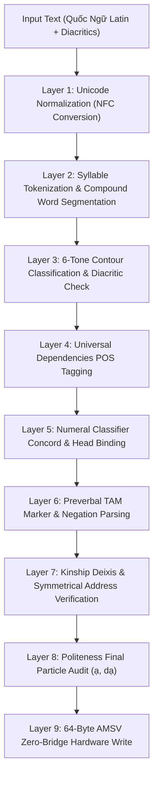

# Vietnamese Cognitive Pipeline & 64-Byte AMSV Memory Architecture (Algorithms Layer)

## 1. 9-Layer Cognitive Processing Pipeline



## 2. 64-Byte Atomic Memory State Vector (AMSV) Hardware Layout

Under **The Zero-Bridge Synchronous Memory Rule**, the Vietnamese Engine communicates with the hardware runtime via a 64-byte shared physical memory structure (`0x56494554` - "VIET"):

```
Offset  Bytes  Type       Field Description
--------------------------------------------------------------------------------
0x00    4      char[4]    Magic Bytes: 0x56494554 ("VIET")
0x04    1      uint8_t    Engine Major Version (0x01)
0x05    1      uint8_t    Engine Minor Version (0x00)
0x06    1      uint8_t    Engine Mode (0=Init, 1=Inference, 2=RealTime, 3=Batch)
0x07    1      uint8_t    Dialect Mode (1=Northern/Hanoi, 2=Central/Hue, 3=Southern/Saigon)

0x08    8      uint64_t   Tone Distribution & Prosodic Pitch Contour Bitfield
0x10    2      uint16_t   Syntactic Flags:
                          - Bit 0: SVO Order Confirmed
                          - Bit 1: Head-Initial Noun Phrase Confirmed
                          - Bit 2: Classifier Present (Loại từ)
                          - Bit 3: Preverbal TAM Marker Present
                          - Bit 4: Serial Verb Construction
                          - Bit 5: Topic-Comment Construction
0x12    1      uint8_t    Syntax Sub-AI Capability Status / Score
0x13    1      uint8_t    Classifier Concord & Definiteness Flag
0x14    1      uint8_t    Tone Orthography & Diacritic Conformity Flag
0x15    1      uint8_t    TAM Particle & Aspect Sequencing Flag
0x16    1      uint8_t    Kinship Deixis Tier (1=Peer/Informal, 2=Formal, 3=High Deference)
0x17    1      uint8_t    Politeness Particle Concord Flag (ạ / dạ presence)
0x18    4      float32    Editorial Quality & Grammatical Confidence Score (0.0 .. 1.0)
0x1C    4      uint32_t   Reserved Hardware Extension Vector

0x20    16     uint8_t[16] Semantic & Classifier Category Vector

0x30    4      uint32_t   Task Flags & Execution Status
0x34    1      uint8_t    Syntax Sub-AI Active Flag (0x01 = Active)
0x35    1      uint8_t    Phonology Sub-AI Active Flag (0x01 = Active)
0x36    1      uint8_t    Pragmatic Sub-AI Active Flag (0x01 = Active)
0x37    1      uint8_t    Editorial Sub-AI Active Flag (0x01 = Active)
0x38    8      uint8_t[8] Global Cognitive Attention & Alignment Vector
--------------------------------------------------------------------------------
Total: Exactly 64 Bytes (0-nanosecond physical memory alignment)
```
